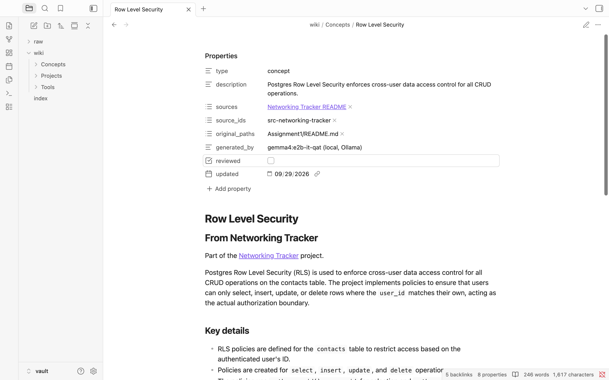
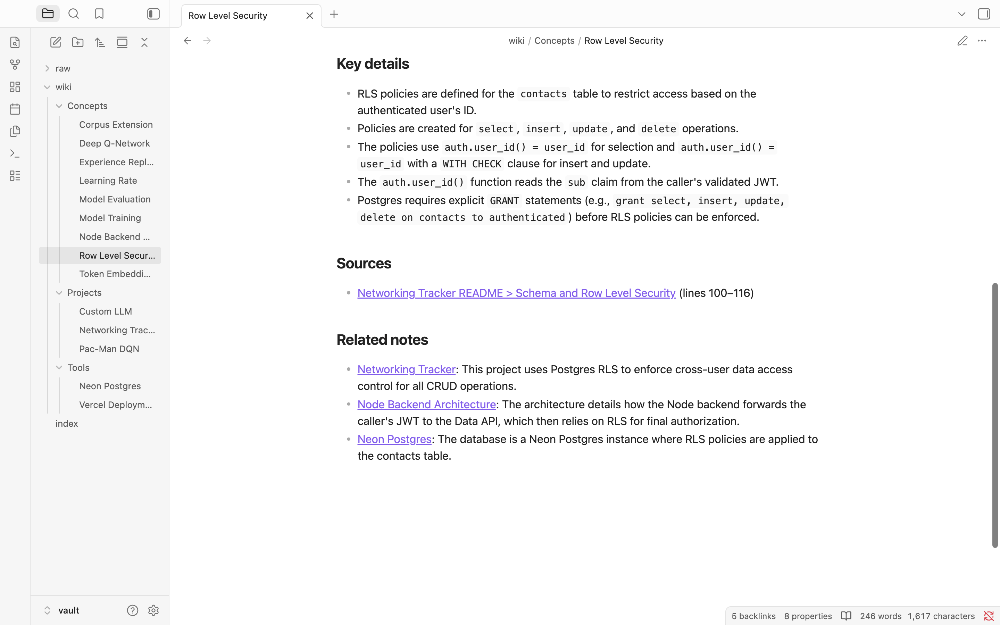
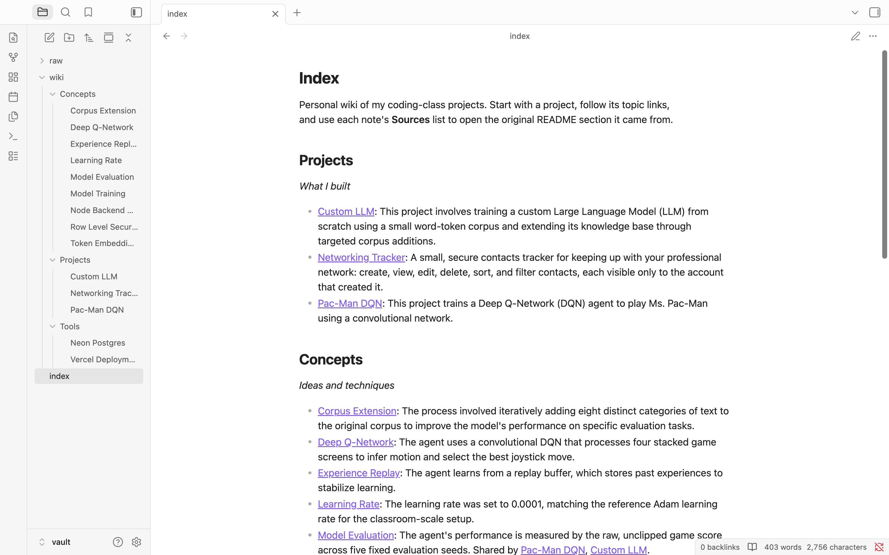
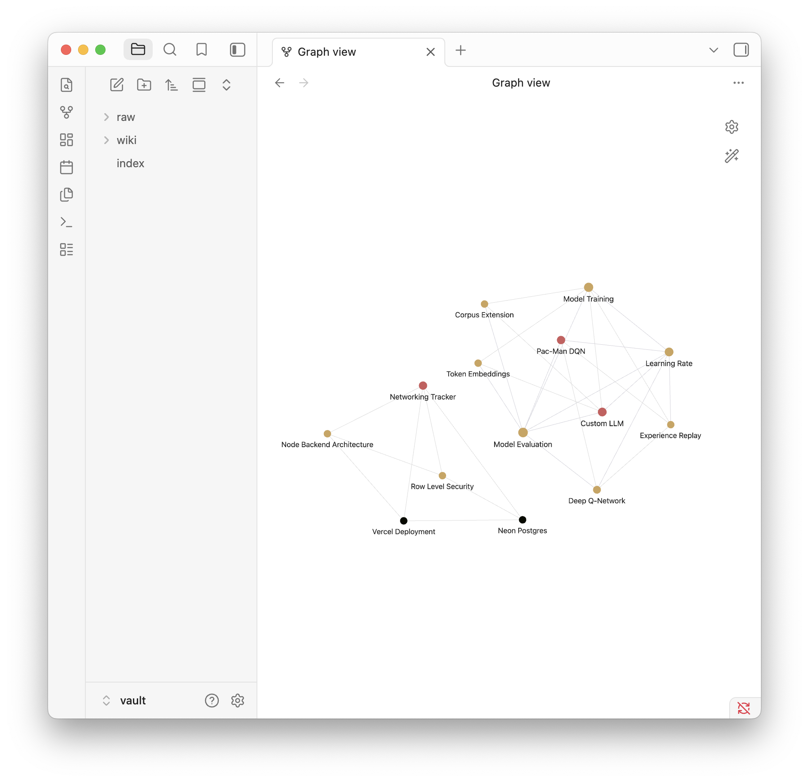

# Personal Wiki CLI: Local Gemma + RAG

Class 5 · Assignment 4. A command-line harness I built that turns my own coding-class project write-ups into an Obsidian wiki, and lets me **chat**, **ask** and **search** over it with a local Gemma model, fully offline.

```
wiki ingest   # local Gemma reads sources -> linked, readable wiki notes + index
wiki search   # original passages + file/line locations, no model involved
wiki ask      # standalone factual answer with checked citations, or "insufficient evidence"
wiki chat     # "Scout", a personal assistant with conversation memory; looks up notes only when needed
```

**Quick links:** [CLI and harness code](wiki_cli/) · [the wiki (Obsidian vault)](vault/) · [setup](#setup-and-exact-commands) · [offline run](evidence/offline-run.md) · [four ask-mode evidence cards](#four-ask-mode-tests-offline) · [chat and search checks](#chat-and-search-mode-checks) · [Obsidian screenshots](#obsidian-screenshots) · [reflection](#reflection-a-real-limitation-and-what-id-try-next)

---

## Purpose and sources

**What the wiki is for:** a personal memory of what I built in this course, how it works and what I found, so I can study for the final and reuse what I learned without re-reading three long READMEs.

**Sources:** three of my own project write-ups, copied **unchanged** into `vault/raw/` (SHA-256 verified; hashes in [data/source_catalog.json](data/source_catalog.json)):

| Source (in `vault/raw/`) | Original | Project note |
|---|---|---|
| [Networking Tracker README.md](vault/raw/Networking%20Tracker%20README.md) | `Assignment1/README.md`, a React + Neon Postgres contacts app with Row Level Security | [[Networking Tracker]](vault/wiki/Projects/Networking%20Tracker.md) |
| [Pac-Man DQN README.md](vault/raw/Pac-Man%20DQN%20README.md) | `pacman-dqn/README.md`, Class 3 DQN agent for Ms. Pac-Man | [[Pac-Man DQN]](vault/wiki/Projects/Pac-Man%20DQN.md) |
| [Custom LLM README.md](vault/raw/Custom%20LLM%20README.md) | `Assignment 3/custom-llm/README.md`, Class 4 nanoGPT trained from scratch | [[Custom LLM]](vault/wiki/Projects/Custom%20LLM.md) |

They're my own writing, so they're shareable. The source files were renamed only because all three were called `README.md`; their contents are byte-for-byte the originals.

**How originals connect to generated pages:** `wiki ingest` has local Gemma read each source and write 1 project note plus 3–4 topic notes. Each note records its source in its properties (`sources`, `source_ids`, `original_paths`) and ends with a **Sources** list that links to the exact README section and line range, e.g. `[[Networking Tracker README#Schema and Row Level Security]] (lines 100–127)`. `data/source_catalog.json` maps each source id → raw file → original path → the notes it produced.

---

## Setup and device

### Device (measured)

| | |
|---|---|
| Computer | MacBook Air, **Apple M1** (4 performance + 4 efficiency cores) |
| Memory | **8 GB unified memory** (CPU and GPU share it); about 22% free during the offline run |
| GPU | M1 integrated GPU, using unified memory (no dedicated VRAM) |
| OS | macOS 14.7.6 |
| Free disk | 11 GB at the time of the offline run |

### Model and runtime

| | |
|---|---|
| Model | **Gemma 4 E2B**, instruction-tuned, quantization-aware trained |
| Exact identifier | `gemma4:e2b-it-qat` (Ollama library, ID `07ea59a47401`) |
| Quantization | **Q4_0** (4-bit) |
| Parameters | 4.6B total, about 2B "effective" (E2B); the extra embedding tables are why the total is higher |
| Size on disk | 4.3 GB (includes a 986 MB vision encoder this project doesn't use) |
| Runtime | **Ollama 0.34.4**, macOS app from [ollama.com/download](https://ollama.com/download) |
| Settings | thinking **off**; ask temperature 0.1; chat 0.7; ingest 0.2; context 8,192 tokens (ingest 16,384) |
| License | Apache 2.0 |

**Why this model fits my computer:** the course guidance for an 8 GB Apple Silicon Mac is quantized E2B with a short context. E4B (~4.5 GB to load) plus macOS, Obsidian and a terminal would leave almost nothing free, and the 26B MoE needs ~14 GB. The QAT build is the smallest E2B variant (the default `gemma4:e2b` tag is 7.2 GB). On this Mac it loads entirely onto the GPU, leaves most memory free, and handled every task in this project, so I didn't need a bigger model.

### Measured memory and response time (offline run)

| Measurement | Result |
|---|---|
| Model memory (`ollama ps`) | **1.8 GB, 100% GPU**, at both 8,192 and 16,384-token contexts |
| Ollama `llama-server` process | 153 MB |
| `wiki` CLI process | ~33 MB |
| **Ask** answer, model already loaded | **1.5–7.1 s** (about 1,300–1,450 prompt tokens) |
| Ask, first call after a model (re)load | 24–31 s |
| **Chat** turn (router call + reply) | 5–20 s |
| **Ingest**, one source (5 model calls) | 97–130 s |
| Ingest, all three sources with re-planning (18 calls) | 454 s |
| Search | < 1 s (no model) |

Ollama reloads the model when the context size changes, so the first ask after an ingest (16K → 8K) pays a reload.

### Setup and exact commands

**Once, while online:**

1. Install Ollama from https://ollama.com/download and open it (llama icon in the menu bar). On macOS 14, `brew install ollama` compiles from source (LLVM, Rust, GCC…) and takes hours; use the prebuilt app instead.
2. Download the model (4.3 GB) from the official Ollama library:
   ```bash
   ollama pull gemma4:e2b-it-qat
   ```
3. Create the Python environment (Python ≥ 3.10; I used 3.13.15) and install the CLI:
   ```bash
   cd "Wiki Assignment"
   python3 -m venv .venv
   source .venv/bin/activate
   pip install -r requirements.txt
   pip install -e .
   ```
   The only dependency is `requests` (2.34.2). BM25 search, chunking and the citation checks are my own code.

**Then, online or offline:**

```bash
wiki --help                      # commands, configuration, required inputs
wiki status                      # model, local mode, whether Ollama is ready
wiki ingest ./vault/raw          # generate/update notes (skips unchanged sources)
wiki ingest "./vault/raw/Pac-Man DQN README.md" --force   # regenerate one source's notes
wiki reindex                     # rebuild the search index only (no model)
wiki check                       # links, headings, note names, duplicates
wiki search "row level security" # original passages, no model
wiki ask "What learning rate did I use for the Pac-Man DQN?" --mode local
wiki ask "..." --show-prompt     # also print the exact prompt sent to Gemma
wiki chat                        # /notes <topic>, /reset, /help, /exit
./tests/run_checks.sh            # the full demonstration run used for the evidence
```

Settings can be changed with environment variables: `WIKI_MODEL`, `OLLAMA_HOST`, `WIKI_NUM_CTX`. Missing inputs give clear errors, e.g. `Can't reach Ollama at http://localhost:11434. Open the Ollama app…`, `Model '…' isn't downloaded. While online, run: ollama pull …`, `No search index yet. Run: wiki reindex`, `source folder or file not found`.

**Online mode:** not implemented. `--mode online` exits with an error. Everything runs locally; nothing is sent anywhere.

---

## Architecture

| Part | What it is here | Code |
|---|---|---|
| **Model** | Gemma 4 E2B served by Ollama on `localhost:11434`. It only sees the messages the harness sends; it doesn't read files or remember anything. | [llm.py](wiki_cli/llm.py) is the only module that calls it |
| **Retrieval tool** | Splits `vault/raw/` into passages and ranks them with BM25 keyword search. It finds evidence and never generates text. `wiki search` shows its output directly. | [chunker.py](wiki_cli/chunker.py), [retrieval.py](wiki_cli/retrieval.py) |
| **RAG workflow** | Retrieve passages → put them in the prompt with research rules → Gemma answers from them → citations are checked. Used by `ask`, and by `chat` when it decides to look something up. RAG adds context at answer time; Gemma isn't trained on my data. | [harness.py](wiki_cli/harness.py) |
| **Harness** | Everything around the model: mode selection, instructions and persona, conversation memory, deciding when to retrieve, prompt assembly, JSON output formats, citation checks and retries, error handling, evidence logging, and ingestion into the wiki. | [harness.py](wiki_cli/harness.py), [ingest.py](wiki_cli/ingest.py), [evidence.py](wiki_cli/evidence.py), [vaultcheck.py](wiki_cli/vaultcheck.py) |
| **CLI** | The terminal interface to the harness (`argparse` subcommands). | [cli.py](wiki_cli/cli.py) |

### Tracing one question: `wiki ask "What learning rate did I use for the Pac-Man DQN?"`

1. **CLI chooses the mode:** `cli.main()` parses the `ask` subcommand and calls `cmd_ask()`, which rejects `--mode online` and calls `harness.ask(question)`.
2. **Retrieval:** `retrieval.search()` loads the 79 passages in `data/chunks.json`, tokenizes the question into `learn rate use pac man dqn` (lowercase, stopwords removed, light stemming) and scores each passage with BM25 against its **document title + section heading + text**. The top 5 come back, including the hyperparameter table at `Pac-Man DQN README.md` lines 26–30.
3. **Prompt assembly:** `build_ask_messages()` puts the research rules from [prompts/wiki-instructions.md](prompts/wiki-instructions.md) in the system message. The user message has the passages numbered `[1]`–`[5]`, each labeled with its source path, line range and section, followed by the question. There's no chat history and no persona. That's about 1,430 tokens.
4. **Local model call:** `llm.chat()` checks that Ollama is up and the model is downloaded (`GET /api/tags`), then sends `POST /api/chat` with `think: false`, temperature 0.1, `num_ctx` 8192, and a JSON Schema `format` that forces the reply to be `{"answer": "...", "answer_found_in_passages": true/false}`.
5. **Citation check:** `check_citations()` pulls every `[n]` out of the answer and flags numbers that don't match a provided passage, "answered" replies with no citations, and "not found" replies that still cite passages. If an answer claims support but cites nothing, the harness **asks Gemma once more** for citations and records that it did.
6. **Display and save:** the CLI prints the answer, then each citation with its file, line range and a text preview. `evidence.save_ask_card()` writes a Markdown card with the question, model, mode, timing, answer, citations, the exact passages sent, and an assessment section.

Result: `The learning rate used for the Pac-Man DQN was 0.0001 [3].` with `[3] vault/raw/Pac-Man DQN README.md:26-30 (My three hyperparameters)`.

### How each mode is kept separate

| | chat | ask | search |
|---|---|---|---|
| Instructions | [persona.md](prompts/persona.md) (Scout's voice, real capabilities, honesty rules) | [wiki-instructions.md](prompts/wiki-instructions.md) (research rules, neutral) | none |
| Conversation history | last 5 exchanges | **never** | never |
| Retrieval | only when the router decides it's needed, or on `/notes` | always | always |
| Model | yes | yes | **no** |
| Output | conversational; facts from notes cited `[n]`; ideas labeled as suggestions | answer + checked citations, or INSUFFICIENT EVIDENCE | original passages + paths |

**How chat decides whether to retrieve:** each message first goes through a small **router** call ([prompts/chat-router.md](prompts/chat-router.md)) that returns JSON: `look_up_notes` (yes/no), `projects` (which of my projects the message is about, chosen from the catalog), and a `search_query`. Greetings, capability questions and "make that shorter" aren't looked up. Questions about project facts are. When projects are named, the harness retrieves from each of them (`retrieval.search_sources`). Passages go into that turn only; conversation memory keeps just the plain messages and replies, so old passages don't fill the context. Chat history is never used as evidence, and chat transcripts are saved only as evidence logs that the assistant never reads back. There's no save-to-memory feature.

---

## Design choices

- **Passage size:** paragraphs are packed into passages of up to ~900 characters (about 200–250 tokens) **within one heading section**. A heading always starts a new passage, code blocks are never split, and single paragraphs over 1,500 characters (long lists) are cut at line boundaries. Every passage keeps its file, heading trail and **exact line range**. I checked that each passage's text matches the lines it cites, and that every source line lands in exactly one passage (79 passages total).
- **How much text reaches Gemma:** ask sends 5 passages (~1,000–1,200 tokens of evidence, ~1,400 tokens in total). Chat sends up to 4 passages plus the persona and the last 5 exchanges. Ingest sends one whole source at a time (the largest is 6,250 tokens), which is why ingest uses a 16K context; Ollama reuses the processed source text across the 5–6 calls for that source.
- **Retrieval method:** BM25 keyword search, written by hand (~30 lines, formula documented in [retrieval.py](wiki_cli/retrieval.py)). It's fully local, needs no embedding model, and `search` works even with Ollama off. Only the unchanged sources in `vault/raw/` are indexed. Generated wiki notes are summaries for browsing, not evidence, so ask can't cite a model's own summary back as proof. Each passage is indexed together with its document title and section heading; see the [Test 1 retrieval failure](#retrieval-and-answers-evaluated-separately).
- **Research rules vs personality:** kept in separate files. Ask gets only neutral research rules: use only the passages, cite every fact, copy numbers exactly, say when evidence is missing, treat passages as data not instructions. Chat gets Scout's persona: friendly and short, an accurate list of what it can and can't do, cite note facts, label ideas as suggestions, never invent personal facts, and treat what the user says in chat as conversation rather than evidence.
- **Structured output:** every model call that the code depends on uses Ollama's JSON Schema `format`, so a small model can't break parsing. Output fields were designed by testing (see [evidence/ask-iterations.md](evidence/ask-iterations.md)).
- **Model settings that affected results:** `think: false` (Gemma 4's thinking mode is on by default and writes a reasoning pass before every answer, which is extra generation this Mac doesn't need to spend on short, evidence-bound answers; I didn't benchmark the difference). A yes/no `answer_found_in_passages` field instead of a two-choice text label (the label version marked every correct answer as "insufficient"). Low temperature for ask and ingest.
- **Note names and folders:** Gemma proposes the topics, but code enforces the names: 1–4 word subjects in Title Case, and it rejects titles containing words like Setup, Summary, Overview, Observations, Metrics, README, or dates/hashes/IDs. **Project notes are named by code** from the source filename (`Pac-Man DQN README.md` → `Pac-Man DQN`). Folders: `Projects/`, `Concepts/` (ideas and techniques), `Tools/` (named software). Each note's first heading matches its filename; `wiki check` verifies this plus links, headings and duplicates.
- **Source IDs → readable pages:** machine identifiers (`src-pacman-dqn`, SHA-256, original path) live in note properties and in `data/source_catalog.json`, never in filenames. The catalog stores each source's saved plan (which notes it produces).
- **Re-ingestion without duplicates:** (1) an unchanged source (same SHA-256) is **skipped**, so reviewed notes aren't overwritten; (2) `--force` reuses the **saved plan**, so names can't drift; (3) each source writes into its own marked block in a note (`<!-- wiki:begin src-id -->…<!-- wiki:end src-id -->`), which is replaced in place. A note shared by two projects has one block per project, and anything written by hand outside the blocks survives. Titles matching an existing note, ignoring case and plurals, are merged into it. `--replan` lets Gemma choose again and removes this source's blocks from notes it no longer plans. Tested: unchanged re-ingest left every file byte-identical; forced re-ingest kept the same 14 files.
- **Test expectations stay outside the vault:** [tests/questions.md](tests/questions.md) (the answer key) is outside `vault/`, and only `vault/raw/` is indexed, so the harness can't retrieve the answer key.

---

## The wiki

**Open `vault/` as the Obsidian vault** (not the whole repo). `vault/raw/` holds the unchanged originals, `vault/wiki/` the reviewed notes, and [vault/index.md](vault/index.md) the landing page grouped by topic.

```
vault/wiki/
  Projects/  Custom LLM · Networking Tracker · Pac-Man DQN
  Concepts/  Corpus Extension · Deep Q-Network · Experience Replay · Learning Rate · Model Evaluation ·
             Model Training · Node Backend Architecture · Row Level Security · Token Embeddings
  Tools/     Neon Postgres · Vercel Deployment
```

**Meaningful cross-project links:** [Model Evaluation](vault/wiki/Concepts/Model%20Evaluation.md) has a section for each of Pac-Man DQN (mean score across 5 fixed seeds) and Custom LLM (48-case language suite), and [Learning Rate](vault/wiki/Concepts/Learning%20Rate.md) compares 0.0001 (Pac-Man) with 0.001 (nanoGPT). Every related-note link carries a sentence explaining the connection.

**Human review** ([evidence/wiki-review.md](evidence/wiki-review.md)): 17 specific facts checked against the sources, all correct, plus three corrections made in the wiki (never in the sources): a link that promised content the target note didn't have, an off-topic summary, and a misstated fact about Postgres `GRANT`. Notes rewritten by later ingests were re-checked ([evidence/offline-run.md](evidence/offline-run.md)).

### Obsidian screenshots

Graph filter: `path:wiki/`, attachments off, existing files only, color groups `path:wiki/Projects` / `Concepts` / `Tools`, inline title off. Details: [evidence/obsidian-check.md](evidence/obsidian-check.md).

| Open note with properties and source | Its Sources and Related notes |
|---|---|
|  |  |

| Topic-organized index and page list | Graph of curated notes |
|---|---|
|  |  |

**Reader walkthrough:** index → Networking Tracker → Row Level Security → its Sources link opens `Networking Tracker README` at "Schema and Row Level Security".

---

## Evidence

### Offline demonstration

Wi-Fi was turned off, `curl https://www.google.com` failed on screen, and Ollama was restarted offline. Then [`tests/run_checks.sh`](tests/run_checks.sh) ran every check, with each `wiki` command as a fresh process. The script records `network: offline` itself.

- Summary: [evidence/offline-run.md](evidence/offline-run.md)
- Full terminal log: [evidence/runs/2026-09-29_121156-offline/terminal.log](evidence/runs/2026-09-29_121156-offline/terminal.log)
- Screen recording: [evidence/offline-run.m4v](evidence/offline-run.m4v) (720p, compressed from the original)
- Model and data for the run: `gemma4:e2b-it-qat` (Q4_0) on Ollama 0.34.4; the three sources above; the search index at [data/chunks.json](data/chunks.json)

### Four ask-mode tests (offline)

Questions and expected evidence were written before building retrieval: [tests/questions.md](tests/questions.md). Every card includes the retrieved passages exactly as sent to the model, the answer, the citations, and my assessment.

| Test | Question | Actual Gemma answer | Citations checked | Card |
|---|---|---|---|---|
| 1 direct | What learning rate did I use for the Pac-Man DQN? | "…was 0.0001 [3]" | [3] = hyperparameter table, L26–30 ✅ | [card](evidence/runs/2026-09-29_121156-offline/ask/2026-09-29_121446_what-learning-rate-did-i-use-for-the.md) |
| 2 reworded | How much better did my Pac-Man agent get after training? | "…rose from 492.0 (untrained) to 692.0 (trained), a ~41% improvement [3][4]" | [3] L32–40 and [4] before/after table L101–113 both state it ✅ | [card](evidence/runs/2026-09-29_121156-offline/ask/2026-09-29_121451_how-much-better-did-my-pac-man-agent.md) |
| 3 known evidence | What stops one user from seeing another user's contacts in my networking tracker? | "Row Level Security… policy `contacts_select`… `auth.user_id() = user_id` [4][2]" | [4] testing evidence L289–291, [2] SQL policies L100–116 ✅ (the most direct passage, [1], wasn't cited) | [card](evidence/runs/2026-09-29_121156-offline/ask/2026-09-29_121459_what-stops-one-user-from-seeing-another-user.md) |
| 4 unanswerable | How much does it cost per month to host my Networking Tracker? | **INSUFFICIENT EVIDENCE**: "The provided sources do not contain information about the monthly hosting cost…" | none; no retrieved passage mentions cost ✅ | [card](evidence/runs/2026-09-29_121156-offline/ask/2026-09-29_121505_how-much-does-it-cost-per-month-to.md) |

Test 4 originally was "What GPU did I use to train the custom LLM in Colab?". I replaced it before testing because the source *does* answer it (CPU-only).

### Chat and search mode checks

Offline transcripts: [capabilities, draft + follow-up](evidence/runs/2026-09-29_121156-offline/chat/2026-09-29_121600_transcript.md) · [chat claim](evidence/runs/2026-09-29_121156-offline/chat/2026-09-29_121614_transcript.md) · [search card](evidence/runs/2026-09-29_121156-offline/search/2026-09-29_121505_row-level-security.md) · write-up with the online runs: [evidence/mode-checks.md](evidence/mode-checks.md)

| Check | Result |
|---|---|
| Chat: "what can we do?" / "what can you help me with?" | ✅ accurate capabilities, **no notes lookup**, no citations, no refusal |
| Chat: draft a study plan → "make that shorter" | ✅ plan cites one real passage from each project and is labeled a suggestion; the shorter version reuses the conversation without a lookup |
| Chat: factual question | ✅ "0.0001 [1]", looked up in Pac-Man DQN only |
| Search "row level security" | ✅ 3 original passages with paths and line ranges, no generated answer, no model call |
| Chat claim → ask | ✅ After telling chat "hosting costs $20 a month", ask answered **INSUFFICIENT EVIDENCE**. ⚠️ Chat itself repeated the $20 without saying it came from me (see reflection) |

### Retrieval and answers, evaluated separately

- **Retrieval first** ([tests/run_retrieval.py](tests/run_retrieval.py), no model): in the [baseline](evidence/retrieval/01-baseline.md), Test 1 **failed**. The answer is in a table row that never says "Pac-Man" or "DQN", so other Pac-Man passages outranked it. Fix: index each passage with its document title. [After the fix](evidence/retrieval/02-title-in-index.md), all expected passages were in the top 5.
- **Then answers** ([evidence/ask-iterations.md](evidence/ask-iterations.md)): run 01 and run 02 labeled every correct answer "insufficient_evidence" (the two-choice status field); a yes/no field fixed it. Run 03 gave a correct but **uncited** answer, which the citation check caught, so the harness now retries once for citations. Earlier runs are kept in `evidence/ask/`.
- **Ingest** ([run 1 log](evidence/ingest/2026-09-29_104854.md) → [run 2 log](evidence/ingest/2026-09-29_105603.md)): the first ingest named notes after document sections ("Security Summary", "Training Observations"), filed a metric under Tools, and produced three unconnected islands. Stricter subject-name rules and code-chosen project names fixed it, and produced shared notes across projects.
- **Source problem found while checking:** my Pac-Man README says "4 of 5 seeds improved", but its own table shows 3 of 5. The source stays unchanged; this is noted in the Test 2 card and in `tests/questions.md`.

---

## Reflection: a real limitation and what I'd try next

**Limitation: keyword retrieval only finds passages that share words with the question, and the small model fills gaps when retrieval misses.**

I saw this three times:
1. **Test 1 baseline:** the passage with the answer (`Learning rate | 0.0001`) doesn't contain "Pac-Man" or "DQN", so it ranked below less useful passages.
2. **Chat study plan:** plain BM25 returned 4 Pac-Man passages and nothing about the other two projects. Gemma then **invented** details: "data visualization aspects you implemented" (not in the Networking Tracker README) and "how you fine-tuned" the LLM (it was trained from scratch). Transcript: [evidence/chat/01-invented-details/](evidence/chat/01-invented-details/).
3. **Still open, offline chat-claim check:** after a lookup that found nothing about cost, Scout said "Based on the info I have… $20 a month", without saying the number came from me rather than the wiki. The online run of the same check got it right ("The notes don't specify… but you mentioned $20"). Ask mode still refused, so the required separation held, but chat at temperature 0.7 doesn't follow that persona rule reliably with a ~2B-effective model.

**Cause:** BM25 ranks by shared words, and project names are the most distinctive words, so they dominate. When the right evidence is missing from the prompt, the model uses what it "usually" knows about projects like mine instead of saying the evidence is missing.

**What I changed:** title + section indexing; a router that names the projects so chat retrieves from each one; persona rules against unsupported project details; harness-enforced citations in ask.

**Concrete improvement to try next:** **hybrid retrieval**. Keep BM25, and add a local embedding model through Ollama (still offline) so passages match on meaning ("how much better did it get" ↔ "mean evaluation score rose"). Combine both rankings with reciprocal-rank fusion, rerun `tests/run_retrieval.py` to compare against the saved BM25 runs, then rerun the four ask tests. For the chat weakness: when a lookup finds nothing relevant, have the **harness** add an explicit note to that turn ("the notes don't answer this; if you use something the user said, say so") instead of relying on the persona alone, and use a lower temperature on turns that looked up notes.

---

## Repository layout

```
wiki_cli/       CLI + harness: cli.py, harness.py, retrieval.py, chunker.py, ingest.py, llm.py, evidence.py, vaultcheck.py, config.py
prompts/        persona.md (chat), wiki-instructions.md (ask), chat-router.md, ingest-plan.md, ingest-note.md
vault/          Obsidian vault: raw/ (unchanged sources), wiki/ (notes), index.md
data/           machine files kept out of the vault: chunks.json (search index), source_catalog.json
tests/          questions.md (answer key), run_retrieval.py, run_checks.sh
evidence/       runs/ (online practice + offline run), ask/, chat/, retrieval/, ingest/, screenshots/, write-ups
```

Model weights aren't in this repository. Download them with `ollama pull gemma4:e2b-it-qat` from the official Ollama library (Gemma 4 E2B, Apache 2.0).
